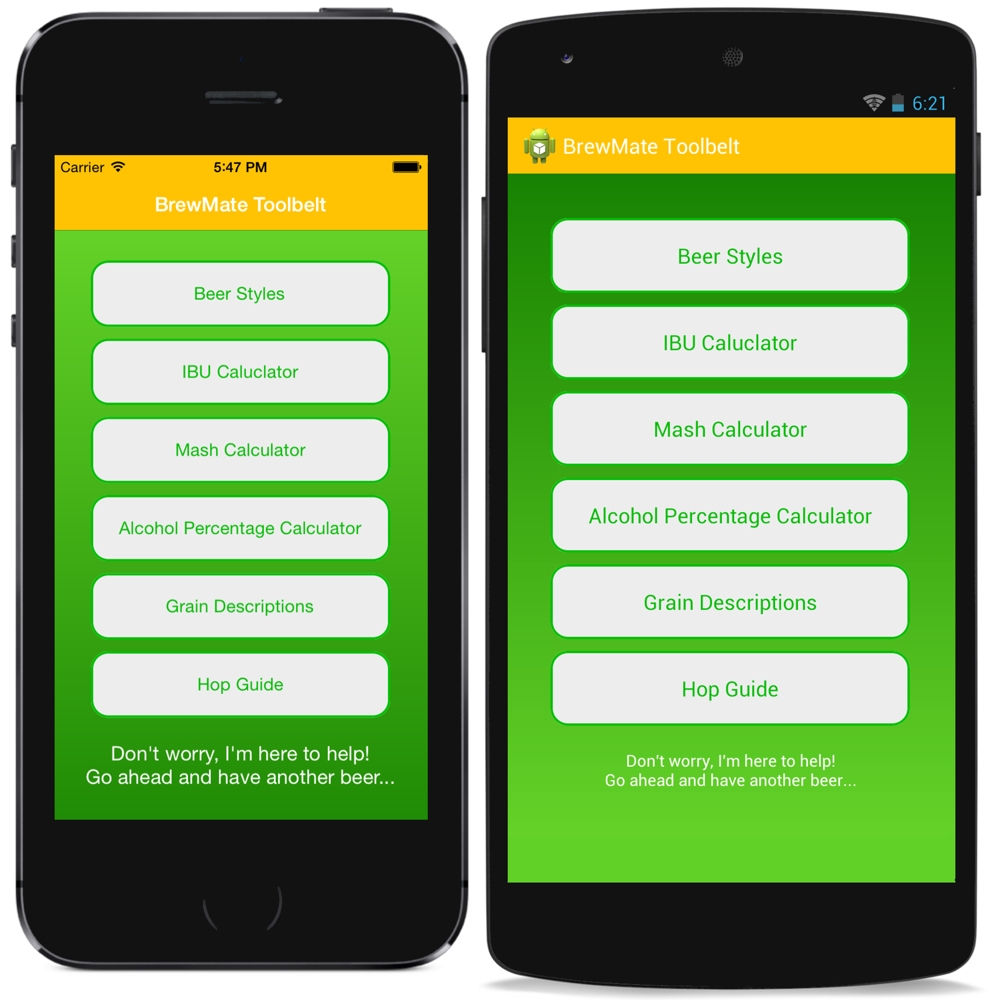

#BrewMate Toolbelt

I am a die-hard homebrewer and I decided to make my first application around beer. All for beer and beer for all! This application has a lot of functionality from being able to calculate the international bittering units of your recipe to calculating the color, OG estimate, FG estimate, Efficiency calculator. I also included multiple other guides to assist while brewing your favorite beer. 

I will be creating working on upgrading this application to managing recipes and tracking everything about your brewery! Please feel free to reach out to me if you have any suggestions on adding features or certain functionality.

##What is BrewMate made of?
###Stats
I'm basing these stats off of the production application found in the platform application stores. This GitHub has additional code to show how UI can be created in Xamarin.Forms with XAML or programmatically.

* 4,887 lines of shared code between iOS and Android applications
* 136 lines of Xamarin.Android code
* 126 lines of Xamarin.iOS code
* 95% of code is shared between the iOS and Android application
* 6 cross-platform automation tests
	* Still undergoing work
* UI is shown being built with both XAML and programmatically
	* Navigate to BrewMate > Pages to find the corresponding folders 

BrewMate is a cross-platform (iOS and Android) application that leverages Xamarin.Forms, Xamarin.Insights and Xamarin Test Cloud. Xamarin.Forms enables BrewMate to share 95% of the code between iOS and Android. The remaining 5% of platform-specific code is used for Custom Renderers.

##What is in the pipeline for BrewMate?
1. Incorporate SQLite for databases
	* Add option to create hops and grains that save to database 
2. Upgrade application to include Windows Phone
	* Teting will be unavailable on Windows Phone until it is supported by Xamarin Test Cloud
3. Begin working on next version of application 
	* Leverage push notifications with Azure
	* Create database storage access
	* Create ability to collaborate on recipes
